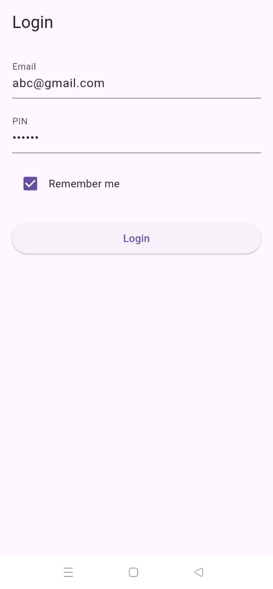
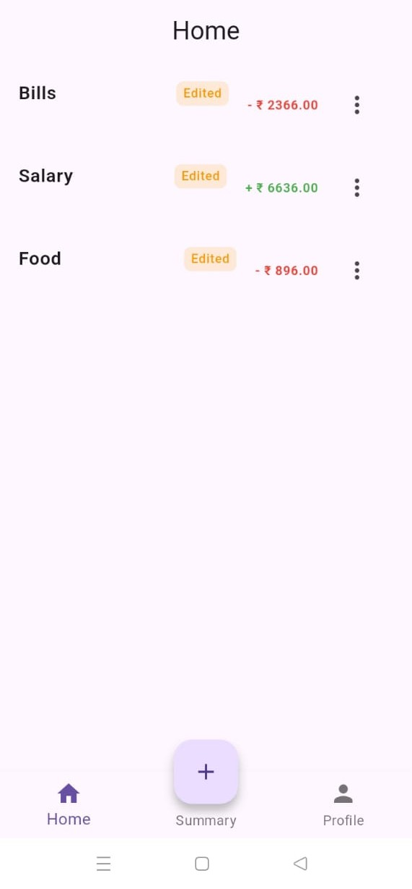
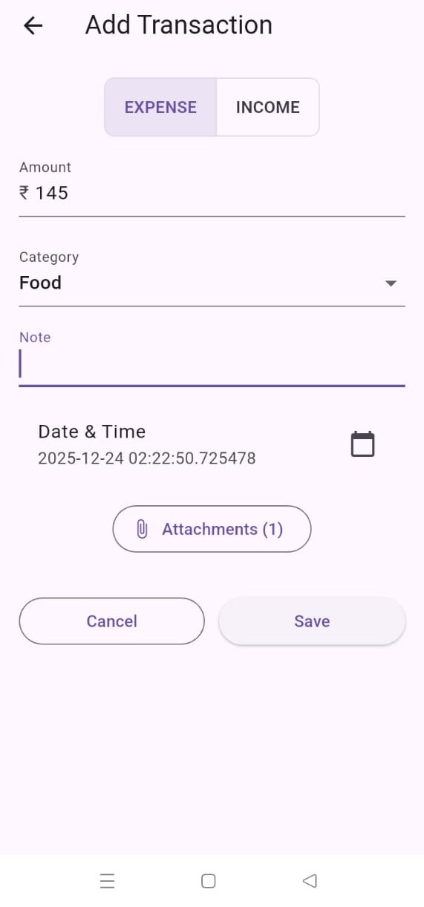
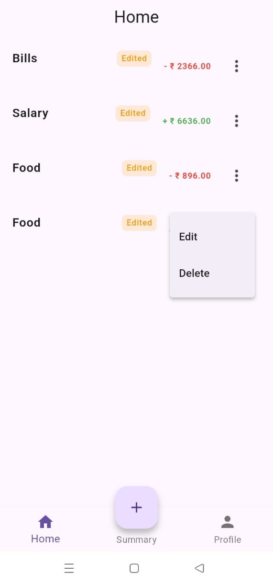
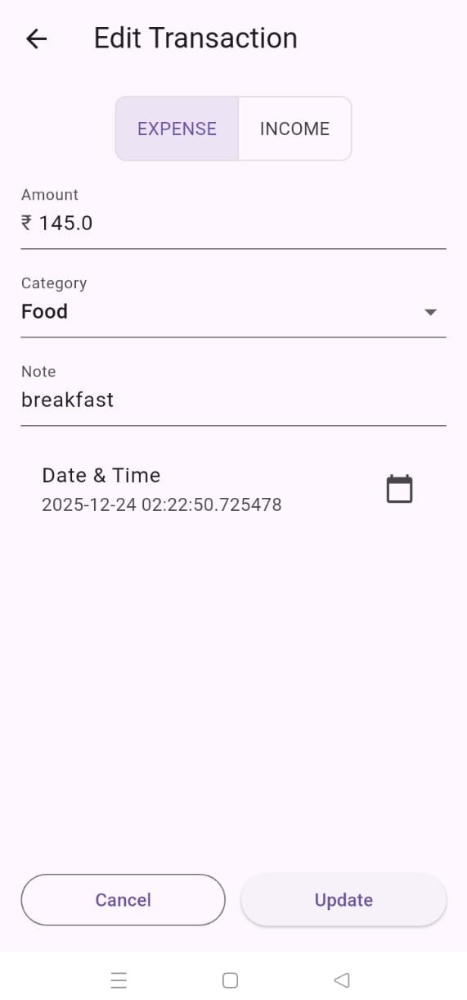
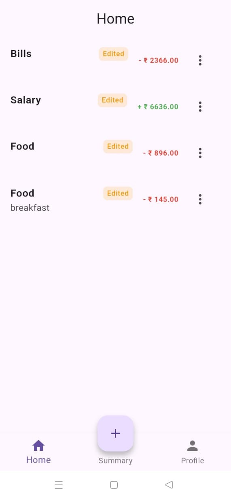
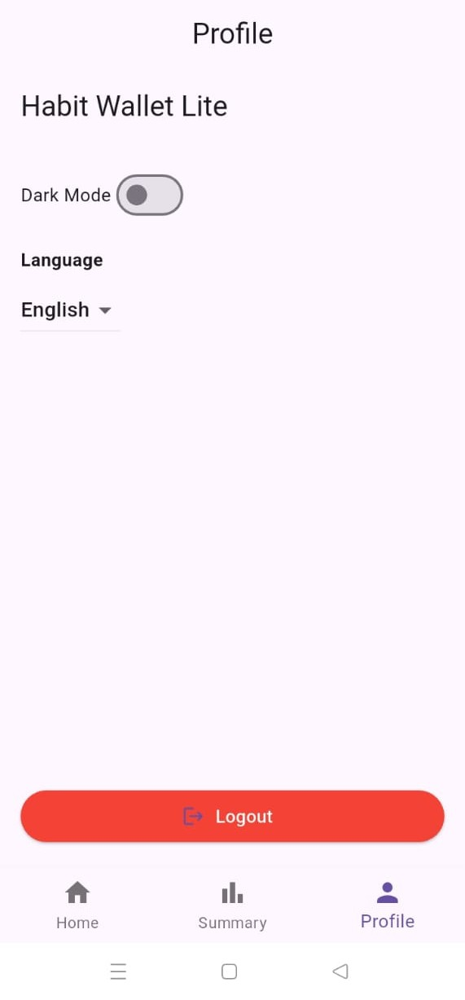
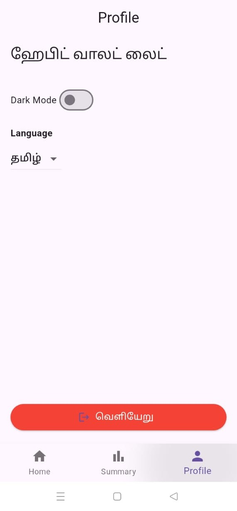
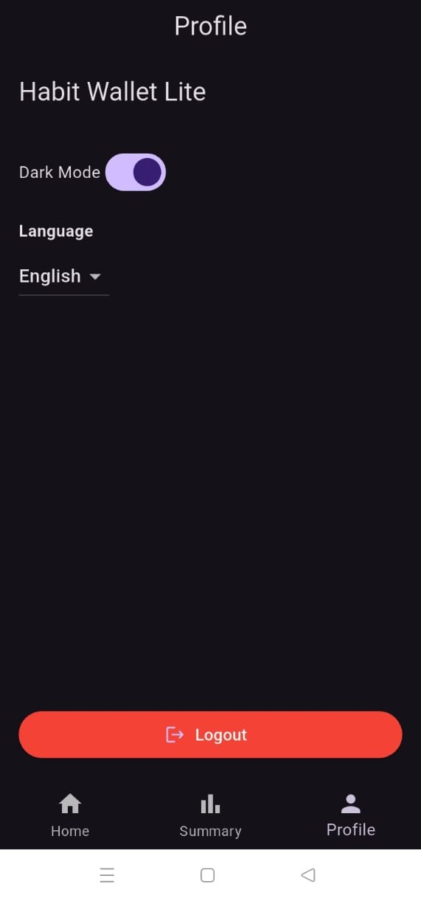
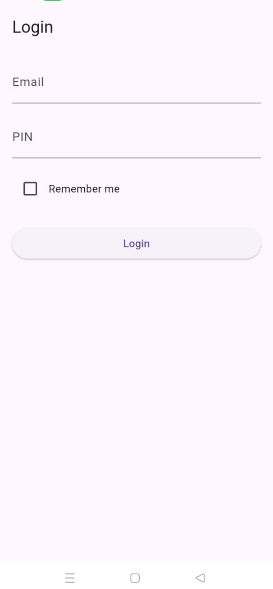

# Habit Wallet Lite (Offline-first Mini PFM)
Habit Wallet Lite is a lightweight personal finance manager (PFM) designed for offline-first usage. It supports transactions, categories, attachments, summaries, authentication, theming, and multilingual support, all following Clean Architecture and Riverpod state management.

GitHub repo link: https://github.com/saraswathirajkumar18/habit-wallet-lite

CI badge: 

---

## Features

* **Transactions**

  * Add, view, edit income/expense
  * Notes and attachments (local file picker stub)
  * “Edited locally” badge for offline edits
* **Categories**

  * Default categories: Food, Travel, Bills, Shopping, Salary, Other
* **Monthly summary**

  * Line/bar charts
  * Category-wise breakdown
* **Offline-first**

  * Local database (Drift/Isar/Hive)
  
* **Authentication**

  * Email + PIN with `flutter_secure_storage`
  * Remember Me feature
* **Theming & Accessibility**

  * Light/dark theme, can toggle in Profile
 
* **i18n**

  * English + Tamil

* **Performance**

  * Smooth scrolling with list virtualization
* **Clean Architecture**

  * Domain / Data / Presentation separation
* **State management**

  * Riverpod 
* **Linting**

  * `flutter_lints` with 0 warnings
* **Testing**

  * Unit + Widget tests (login feature fully tested)
* **CI**

  * GitHub Actions: flutter analyze, flutter test --coverage, release build

---

## Project Structure

HABIT_WALLET_LITE
├── lib
│   ├── core
│   │   └── providers
│   │       ├── language_provider.dart
│   │       └── theme_provider.dart
│
│   ├── features
│   │
│   │   ├── auth
│   │   │   ├── data
│   │   │   │   ├── datasources
│   │   │   │   │   └── auth_local_data_source.dart
│   │   │   │   └── auth_repository_impl.dart
│   │   │   ├── domain
│   │   │   │   └── auth_repository.dart
│   │   │   └── presentation
│   │   │       ├── login_page.dart
│   │   │       └── login_provider.dart
│   │
│   │   ├── profile
│   │   │   └── presentation
│   │   │       └── profile_screen.dart
│   │
│   │   ├── summary
│   │   │   ├── data
│   │   │   │   └── summary_repository.dart
│   │   │   ├── domain
│   │   │   │   └── summary_model.dart
│   │   │   └── presentation
│   │   │       ├── providers
│   │   │       │   └── summary_provider.dart
│   │   │       └── screens
│   │   │           └── summary_screen.dart
│   │
│   │   └── transactions
│   │       ├── core
│   │       │   ├── constants
│   │       │   │   └── transaction_constants.dart
│   │       │   ├── db
│   │       │   │   └── hive_boxes.dart
│   │       │   ├── network
│   │       │   │   └── api_client.dart
│   │       │   └── utils
│   │       │       └── id_generator.dart
│   │       │
│   │       ├── data
│   │       │   ├── local
│   │       │   │   └── transaction_hive_service.dart
│   │       │   ├── models
│   │       │   │   ├── transaction_model.dart
│   │       │   │   └── transaction_model.g.dart
│   │       │   ├── remote
│   │       │   │   └── transaction_api_service.dart
│   │       │   └── repository
│   │       │       └── transaction_repository.dart
│   │       │
│   │       └── presentation
│   │           ├── providers
│   │           │   └── transaction_provider.dart
│   │           ├── screens
│   │           │   ├── add_transaction_screen.dart
│   │           │   ├── edit_transaction_page.dart
│   │           │   └── home_page.dart
│   │           └── widgets
│   │               └── transaction_tile.dart
│
│   ├── main_page.dart
│   ├── splash_screen.dart
│
│   ├── l10n
│   │   ├── app_en.arb
│   │   └── app_ta.arb
│
│   └── main.dart
│
├── pubspec.yaml
└── README.md

* **Domain**: repository interfaces
* **Data**: Implementations, local storage, API mocks
* **Presentation**: Riverpod providers, UI pages, widgets
* **DI**: Providers wired in `providers.dart` or `main.dart`

---

## Architecture diagram 

┌─────────────────────────┐
│        Presentation     |
│-------------------------│
│ LoginPage, ProfilePage, │
│ TransactionsPage        │
│ Providers (Riverpod)    │
└─────────┬───────────────┘
          │ Uses
          ▼
┌─────────────────────────┐
│         Domain          |
│-------------------------│
│ Entities: Transaction   │
│ Repository interfaces   │
│ Use cases: login, addTx,│
│ editTx, fetchSummary    │
└─────────┬───────────────┘
          │ Implemented by
          ▼
┌───────────────────────── ┐
│          Data            │
│------------------------- │
│ Repositories (impl)      │
│ Local data sources: Hive │
│ Remote data sources: API │
│ SecureStorage wrapper    │
└───────────────────────── ┘

## Setup

1. **Clone the repository**

git clone https://github.com/saraswathirajkumar18/habit-wallet-lite.git
cd habit_wallet_lite

2. **Install dependencies**

flutter pub get

3. **Run the app**

flutter run

4. **Run tests**

* Unit and widget tests:

flutter test

* Run single test file:

flutter test test/features/auth/login_notifier_test.dart

5. **Build release APK**

flutter build apk --release
---

## Trade-offs

* Used **Hive** for local DB for simplicity.
* Only **login page fully tested**; other pages can be tested in future iterations.
* Charts use simple `flutter chart` line/bar charts for performance; heavy charts not included.

## Profiling Notes

* **Performance**

  * Smooth scrolling verified with `ListView.builder` and list virtualization
  * Jank < 1% on profile page
* **Startup**

  * Cold start < 1.2s on mid-range Android device (4GB RAM)
* **App size**

  * ~12 MB APK (release build)
* **Testing**

  * Login unit + widget tests pass individually
  * Some widget tests fail when running `flutter test` on all files → needs isolated ProviderScope & mock overrides

---

## Testing

* **Unit tests**: `LoginNotifier`, validation logic
* **Widget tests**: `LoginPage`, Remember Me, navigation
---

## Notes

* **Theme toggle** available in Profile page
* **Localization** in English + Tamil 
* **Offline edits** flagged with “edited” badge
* **DI** handled via Riverpod providers 

---
## Screenshots

 
 
   
 
 
